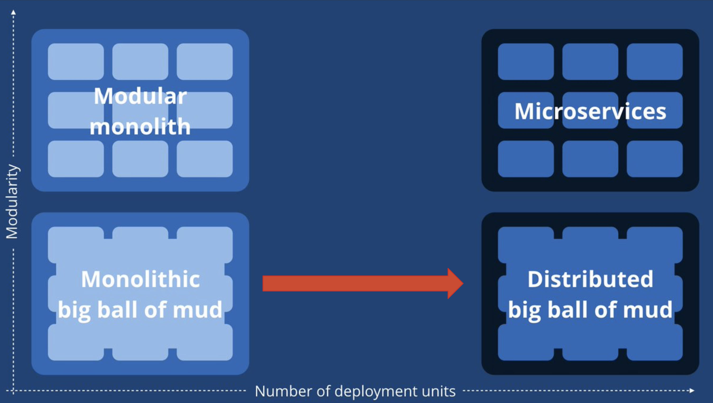

# Des microservices aux migroservices

## Cartouche d'identification

- Manifestation : CodeursEnSeine 2018
- Lieu : Kindarena - Rouen
- Conférence : Des microservices aux migroservices
- Horaire de la conférence : 10h00
- Durée de la conférence : 1h
- Conférencier(s) :
  - Francois Teychene ([Twitter](https://twitter.com/fteychene), [GitHub](https://github.com/fteychene))
- Audience : 100 spectateurs
- Auteur du billet : Tom Masson
- Mots-clés: Microservice, migroservice, monolith, distributed services, automatisation, container
- URL de l'illustration : 

## Support

- Lien vers le support (diapos) présenté en conférence : [Slides conférence](https://docs.google.com/presentation/d/1Z3hkFPBPBTX7sRxmwzBnPfS_AaI6zLz18BrMeSpmXw8/present?slide=id.g480600b79f_0_1973)
- Nombre de diapos du support : 87
- Plan du support :

## Résumé

La volonté de migrer sur des projets utilisant les microservices est de plus en plus présente au sein des entreprises. Le microservice est à la mode, notemment à cause des architectures monolithiques lourdes, lentes, peu maintenables et peu scalables. Cette architecture semble être une solution toute faite résolvant beaucoup de points négatifs assez facilement. Cependant, les débuts ne sont pas évident. La première mise en production d'une telle architecture est souvent synonyme d'échec. En effet, il y a beaucoup de technologies différentes qui sont chères techniquement, un système de déploiement automatique à mettre en place ainsi qu'un traitement des erreurs, un système de logs et du "recovering"... Tous ces systèmes doivent être pensés dès le début du projet. En plus de cela, il faut arriver à rester dans le cadre des microservices et ne pas passer dans le migroservice. En effet, il est assez aisé de se perdre dans le fil de développement de son application et de finir avec des bouts de monolithe dans un service.
Une solution hybride et moins couteuse que de faire du microservice, serait de faire du monolithe modulaire: un bon compromis selon F. Teychene.

## Architecture et facteur qualité

...
